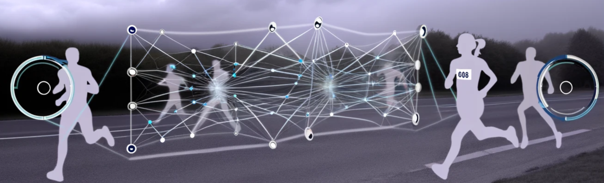

# Aplicación de Técnicas de Visión por Computadora para la Identificación de Corredores Mediante Números Dorsales



## Descripción del Proyecto

Este proyecto tiene como objetivo desarrollar un sistema de visión por computadora para identificar números dorsales en corredores, utilizando tecnologías avanzadas como YOLOv4 y redes neuronales convolucionales (CNNs). La implementación se basa en los repositorios de GitHub [bib-detector](https://github.com/ericBayless/bib-detector/tree/main) de [ericBayless](https://github.com/ericBayless) y [BibObjectDetection](https://github.com/Lwhieldon/BibObjectDetection) de [Lwhieldon](https://github.com/Lwhieldon), los cuales han sido adaptados para satisfacer nuestras necesidades específicas.

### Tecnologías Utilizadas

- **YOLOv4-tiny**: Un modelo de detección de objetos eficiente y rápido, adecuado para su implementación en tiempo real.
- **Redes Neuronales Convolucionales (CNNs)**: Utilizadas para el procesamiento y la clasificación de imágenes.
- **Streamlit**: Una herramienta poderosa para crear aplicaciones web interactivas en Python.

## Estructura del Proyecto

- **data**: Contiene los modelos entrenados en YOLOv4-tiny, tanto del grupo 1 como del grupo 2, y algunas imágenes de prueba.
- **documents**: Informes generados a lo largo del desarrollo del proyecto.
- **media**: Imágenes como logos de la aplicación y otras usadas en el frontend.
- **detector.py**: Contiene las funcionalidades necesarias para detectar números dorsales en las imágenes. Utiliza modelos de YOLOv4-tiny entrenados específicamente para este propósito.
- **app.py**: Aplicación creada con streamlit. Utiliza las funciones definidas en `detector.py` para procesar las imágenes y mostrar los resultados a través de una interfaz de usuario intuitiva.

## Ejecución

1. Instalar las dependencias necesarias:

    ```powershell
    pip install -r requirements.txt
    ```

2. Para ejecutar la aplicación, utilice el siguiente comando:

    ```powershell
    streamlit run app.py
    ```

    Este comando lanzará la aplicación y estará lista para su uso en su navegador web predeterminado.

## Equipo de trabajo (HPCV Grupo 2)

- [Diego Fernando Lojan](https://github.com/DiegoFernandoLojanTN) [diego.lojan@unl.edu.ec]
                
- [Angel Jahir Román](https://github.com/jahirxtrap) [angel.roman@unl.edu.ec]
                
- [Cecilia Fernanda Trueba](https://github.com/cftr28) [cecilia.trueba@unl.edu.ec]

## Recursos adicionales

### Estudios

- [Racing Bib Number Recognition](https://people.csail.mit.edu/talidekel/RBNR.html)
- [Racing Bib Number Recognition Using Deep Learning](https://www.researchgate.net/publication/335234017_Racing_Bib_Number_Recognition_Using_Deep_Learning)

### Entrenando YOLO

- [Train YOLOv4-tiny on Custom Data - Lightning Fast Object Detection](https://blog.roboflow.com/train-yolov4-tiny-on-custom-data-lighting-fast-detection/)

### YOLO y OpenCV
- [OpenCV tutorial: YOLO - object detection](https://opencv-tutorial.readthedocs.io/en/latest/yolo/yolo.html)